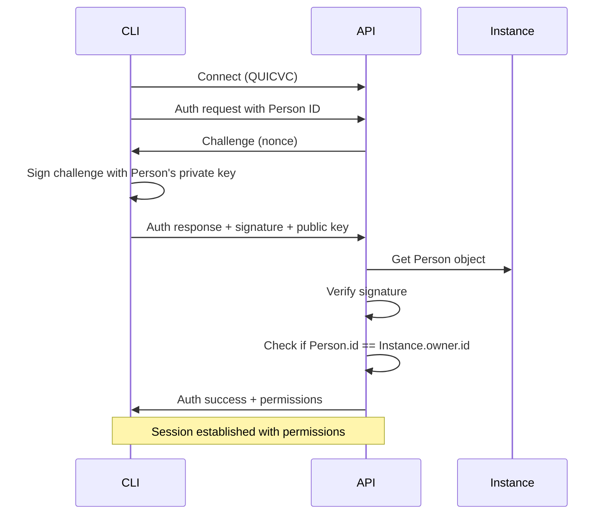

# Refinio API & CLI Documentation

## Overview

The Refinio API and CLI provide a QUICVC-based interface for managing ONE objects and recipes. The system uses ONE platform's Instance ownership model where each API server is an Instance, and users authenticate with their Person keys.

## Architecture

### Trust Model

Based on ONE platform's Instance ownership model:

1. **Instance Ownership**: Each API server is an Instance owned by a Person
2. **Person Authentication**: Users authenticate with their Person keys
3. **Owner Authority**: Instance owner has admin privileges
4. **Permission Grants**: Owner can grant permissions to other Persons
5. **Cryptographic Identity**: Ed25519 signatures verify Person identity

### Key Components

#### API Server (`refinio.api`)
- QUIC server listening on configurable port (default: 49498)
- Credential-based authentication
- CRUD operations for ONE objects
- Recipe management
- Real-time event streaming

#### CLI Client (`refinio.cli`)
- QUIC client for API communication
- Local credential storage
- Command-line interface for operations
- JSON and human-readable output formats

## Authentication Protocol

### Initial Setup

1. **Person Keys Structure**
   ```json
   {
     "personId": "sha256-hash-of-person",
     "publicKey": "encryption-public-key-hex",
     "privateKey": "encryption-private-key-hex",
     "signPublicKey": "signing-public-key-hex",
     "signPrivateKey": "signing-private-key-hex"
   }
   ```

2. **Key Generation**
   ```bash
   # Generate new Person keys
   refinio auth generate alice@example.com
   
   # Keys are saved to ~/.refinio/keys.json
   ```

3. **Instance Setup**
   - API server creates/loads Instance with owner
   - Instance owner email determines admin
   - Owner's Person ID grants full permissions

### Authentication Flow



## Understanding Recipes

In the ONE platform, **recipes are data structure definitions** (schemas), not executable code. They define:
- The shape and structure of ONE objects
- Field types and validation rules
- Relationships between objects
- Required and optional properties

Think of recipes like database schemas or TypeScript interfaces - they describe data, they don't execute operations.

## API Operations

### Object Operations

#### Create Object
```bash
refinio create <type> --data <json-file>
```

#### Read Object
```bash
refinio get <id> [--version <version>]
```

#### Update Object
```bash
refinio update <id> --data <json-file>
```

#### Delete Object
```bash
refinio delete <id>
```

#### List Objects
```bash
refinio list <type> [--filter <query>]
```

### Recipe Operations (Data Structure Management)

#### Register Recipe (Admin Only)
```bash
# Register a new data structure definition
refinio recipe register --file recipe.json
```

Example recipe definition:
```json
{
  "name": "CustomMessage",
  "type": "CustomMessage",
  "category": "communication",
  "description": "Custom message data structure",
  "properties": {
    "sender": { "type": "reference", "refType": "Person", "required": true },
    "content": { "type": "string", "required": true },
    "tags": { "type": "array", "items": { "type": "string" } },
    "priority": { "type": "enum", "values": ["low", "medium", "high"] }
  }
}
```

#### List Recipes
```bash
# List all registered data structures
refinio recipe list

# Filter by category
refinio recipe list --category communication
```

#### Get Recipe Definition
```bash
# Get the data structure definition for a recipe
refinio recipe get Person
```

### Stream Operations

#### Subscribe to Events
```bash
refinio stream events [--type <event-type>]
```

#### Watch Object Changes
```bash
refinio watch <id>
```

## QUIC Protocol Details

### Message Format

All messages use JSON over QUIC streams:

```typescript
interface Message {
  id: string;           // Request/response correlation
  type: MessageType;    // Operation type
  timestamp: number;    // Unix timestamp
  payload: any;         // Operation-specific data
}

enum MessageType {
  // Authentication
  AUTH_CHALLENGE = 'auth.challenge',
  AUTH_REQUEST = 'auth.request',
  AUTH_RESPONSE = 'auth.response',
  
  // CRUD Operations
  CREATE_REQUEST = 'crud.create.request',
  CREATE_RESPONSE = 'crud.create.response',
  READ_REQUEST = 'crud.read.request',
  READ_RESPONSE = 'crud.read.response',
  UPDATE_REQUEST = 'crud.update.request',
  UPDATE_RESPONSE = 'crud.update.response',
  DELETE_REQUEST = 'crud.delete.request',
  DELETE_RESPONSE = 'crud.delete.response',
  
  // Recipe Operations
  RECIPE_EXECUTE = 'recipe.execute',
  RECIPE_RESULT = 'recipe.result',
  
  // Streaming
  STREAM_SUBSCRIBE = 'stream.subscribe',
  STREAM_EVENT = 'stream.event',
  STREAM_UNSUBSCRIBE = 'stream.unsubscribe'
}
```

### Error Handling

```typescript
interface ErrorResponse {
  id: string;
  type: 'error';
  error: {
    code: ErrorCode;
    message: string;
    details?: any;
  };
}

enum ErrorCode {
  UNAUTHORIZED = 401,
  FORBIDDEN = 403,
  NOT_FOUND = 404,
  CONFLICT = 409,
  VALIDATION_ERROR = 422,
  INTERNAL_ERROR = 500
}
```

## Configuration

### API Server Configuration

```json
{
  "server": {
    "host": "0.0.0.0",
    "port": 49498,
    "cert": "/path/to/cert.pem",
    "key": "/path/to/key.pem"
  },
  "authentication": {
    "credentialStore": "/path/to/credentials",
    "sessionTimeout": 3600,
    "maxSessions": 100
  },
  "storage": {
    "type": "filesystem",
    "path": "/var/lib/refinio-api"
  },
  "logging": {
    "level": "info",
    "file": "/var/log/refinio-api.log"
  }
}
```

### CLI Configuration

```json
{
  "client": {
    "serverUrl": "quic://localhost:49498",
    "timeout": 30000,
    "retries": 3
  },
  "credentials": {
    "path": "~/.refinio/credentials",
    "autoRotate": true
  },
  "output": {
    "format": "json",
    "color": true
  }
}
```

## Security Considerations

### Key Security
- Person's private keys never leave client
- Keys are user-controlled, not server-issued
- Instance owner verified by Person ID match
- Cryptographic signatures for all auth

### Transport Security
- QUIC provides encryption by default
- Certificate pinning for server authentication
- Replay attack prevention via nonces
- Rate limiting on API endpoints

### Access Control
- Permission-based authorization
- Audit logging of all operations
- Credential revocation support
- Session management with timeout

## Development Guide

### Setting Up Development Environment

1. **Install Dependencies**
   ```bash
   cd packages/refinio.api
   npm install
   
   cd ../refinio.cli
   npm install
   ```

2. **Build Packages**
   ```bash
   npm run build
   ```

3. **Run API Server**
   ```bash
   cd packages/refinio.api
   npm start
   ```

4. **Test CLI Commands**
   ```bash
   cd packages/refinio.cli
   npm link
   refinio --help
   ```

### Testing

#### Unit Tests
```bash
npm test
```

#### Integration Tests
```bash
npm run test:integration
```

#### Load Testing
```bash
npm run test:load
```

## CLI Usage Examples

### Basic Operations

```bash
# Generate Person keys (first time)
refinio auth generate alice@example.com

# Authenticate
refinio auth login --keys ~/.refinio/keys.json

# Create a new object (using a registered recipe structure)
refinio create Person --data person.json

# Get an object
refinio get abc123def456

# Update an object
refinio update abc123def456 --data updated-person.json

# Delete an object
refinio delete abc123def456

# List objects of a type
refinio list Person --filter "name=John*"
```

### Recipe Management (Data Structures)

```bash
# Register a new data structure (admin only)
refinio recipe register --file my-recipe.json

# List all data structures
refinio recipe list

# Get a specific data structure definition
refinio recipe get Profile

# List data structures by category
refinio recipe list --category identity
```

### Real-time Monitoring

```bash
# Watch for changes to an object
refinio watch abc123def456

# Stream all events
refinio stream events

# Stream specific event types
refinio stream events --type object.created --type object.updated
```

## Troubleshooting

### Common Issues

#### Connection Failed
- Check server is running
- Verify firewall allows QUIC (UDP)
- Ensure credentials are valid

#### Authentication Error
- Check credential expiration
- Verify credential signature
- Ensure server recognizes issuer

#### Operation Timeout
- Check network connectivity
- Verify server load
- Adjust timeout settings

### Debug Mode

Enable debug logging:
```bash
export REFINIO_DEBUG=true
refinio --verbose <command>
```

View server logs:
```bash
tail -f /var/log/refinio-api.log
```

## API Reference

### REST-like Endpoints (over QUIC)

| Operation | Path | Description |
|-----------|------|-------------|
| CREATE | /objects | Create new object |
| READ | /objects/:id | Get object by ID |
| UPDATE | /objects/:id | Update existing object |
| DELETE | /objects/:id | Delete object |
| LIST | /objects?type=:type | List objects by type |
| EXECUTE | /recipes/:name | Execute recipe |
| SUBSCRIBE | /events | Subscribe to event stream |

### Response Formats

#### Success Response
```json
{
  "success": true,
  "data": { ... },
  "metadata": {
    "timestamp": 1234567890,
    "version": "1.0.0"
  }
}
```

#### Error Response
```json
{
  "success": false,
  "error": {
    "code": 404,
    "message": "Object not found",
    "details": { ... }
  }
}
```

## Migration from HTTP/REST

For systems migrating from HTTP/REST APIs:

1. **Protocol Change**: HTTP → QUIC
2. **Authentication**: API Keys → Verifiable Credentials
3. **Streaming**: WebSockets → QUIC Streams
4. **Security**: TLS → QUIC Built-in Encryption

### Compatibility Layer

A compatibility proxy is available for gradual migration:
```bash
refinio-proxy --http-port 8080 --quic-server localhost:49498
```

This allows HTTP clients to communicate with the QUIC API during transition.